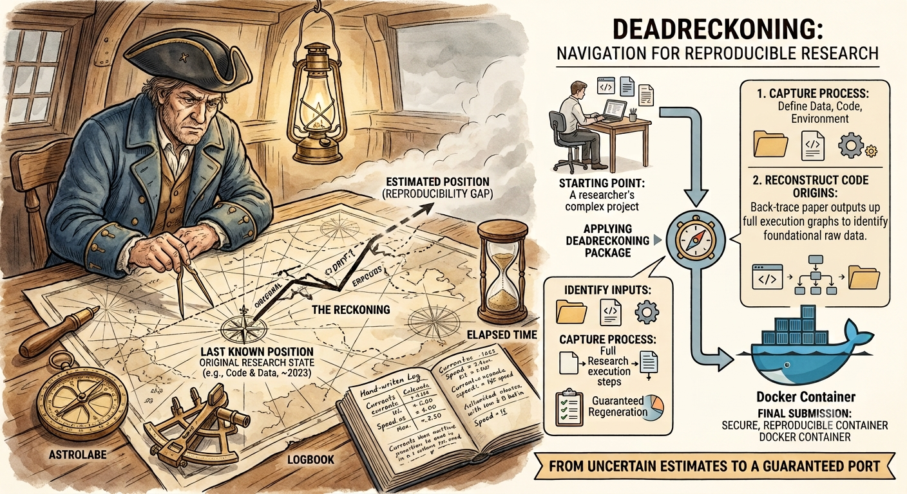

# DeadReckoning — Design Spec

[](https://github.com/floswald/DeadReckoning/actions/workflows/ci.yml)


> **Dead reckoning** *(navigation)*: the process of estimating one's current position based on a previously known position, then accounting for speed, direction, and elapsed time — without access to external reference points such as GPS. Accurate fixes require cross-referencing multiple imperfect signals. The further you have drifted from the last known position, the harder the reckoning.

**Status:** draft v0.1  
**Audience:** economics researchers with little or no experience making their work computationally reproducible  
**Goal:** help an author whose research project is not yet reproducible get it into a state where all outputs can be regenerated from scratch — and then preserve that state in a Docker container for submission





---

## 1. Problem statement

### Creating working replication packages is challenging

Most economics papers take years to write. Code accumulates across multiple machines, collaborators, and software updates. Data lives in Dropbox, on a university server, or on a co-author's laptop. Figures get dragged into submission folders by hand. Numbers get typed into the paper directly. Nobody runs everything from scratch on a regular basis, because there is always a more pressing deadline.

Then the paper is accepted. The journal asks for a replication package. The author sits down to verify that everything still runs — and discovers it does not. Scripts reference files that moved. Software versions changed. Some figures exist on disk but nobody is sure which script produced them. A table in the paper cannot be traced to any piece of code.

**This is the moment this tool is designed for.** Not the ideal scenario where an author has been maintaining a clean, reproducible project all along — that author doesn't need this tool. This is for the other 95%: the author who has a paper, has code, has results, and now needs to reconstruct the computational pipeline that produced them.

The first and primary job of this agent is to help the author get their project into a state where all outputs can be regenerated from a clean start. Docker is what that state is packaged into at the end — so that a replicator at a journal can verify the results without installing the author's exact software stack by hand. But Docker is the last step, not the point. A Docker image built on top of a broken or incomplete pipeline is still broken. The agent works on the pipeline first.

### Why this is hard to do by hand

The author knows the project better than anyone, but faces a specific problem: the work was done incrementally over years, and the decisions made along the way — which version of a package was installed, where the data file was saved, which script produced a given figure — were never written down because they seemed obvious at the time. Recovering that information requires cross-referencing file timestamps, code history, output files, and the paper itself simultaneously. This is tedious and error-prone for a person. It is tractable for a tool that can read all of these sources at once and ask focused questions about what it cannot determine automatically.

The naive version of this tool — "generate a Dockerfile from a project" — solves perhaps 10% of the real problem. Writing `FROM rocker/r-ver`, `COPY . .`, and an entrypoint is already handled by static tools. What is actually hard is reconstructing a working pipeline from a messy, undocumented project, then verifying it runs, then fixing what breaks — a back-and-forth process that requires reading the project, asking questions, and trying things repeatedly.

---

## 2. Prior art and differentiation

| Tool | What it does | Why it's not enough here |
|------|--------------|--------------------------|
| `repo2docker` (Binder) | Auto-detects config, builds image | Notebook-world assumptions; needs declared config; no econ proprietary stack; no fix loop |
| `containerit` (Nüst) | Introspects an R session → Dockerfile | R-only; needs a live, clean session; no multi-language |
| rocker + Posit Package Manager | Dated CRAN snapshots solve R repro | Only works *if* the researcher already used it; most don't |
| `dataeditors/stata` images | BYO-license Stata in Docker | A base image, not a tool that adapts to a messy project |

**The three things this tool must do well (or it shouldn't be built):**

1. Handle the economics **multi-language zoo** (R, Stata, Julia, Python, MATLAB, often mixed in one package).
2. Work even when **no lockfile exists**, by reconstructing the environment through other means.
3. Run an **automated build → run → fix loop** that repeats until the package works.

---

## 3. Minimum requirements: what the author must provide

These are the only inputs the agent cannot find on disk by itself. Everything else — package versions, dependency lists, platform details — it reconstructs. The agent asks for these items first, in plain language, before doing anything else.

| # | What | Why the agent can't find it on its own |
|---|------|----------------------------------------|
| 1 | Location of `paper.tex` and `appendix.tex` (or equivalent) | Starting point for tracing which outputs the paper uses; without it the agent has no authoritative list of exhibits |
| 2 | Location(s) of all code and data | Project may be split across directories, drives, or cloud folders with no common root |
| 3 | Location of any existing documentation (`README`, data dictionaries, codebooks) | May be in a separate folder, a shared drive, or a co-author's notes — not findable by scanning the code directory |
| 4 | Location(s) of produced outputs (figures, tables, processed datasets) | Authors often store outputs outside the main project folder (`submission/`, `Dropbox/Paper/figures/`) |
| 5 | When was all (or which part of) the output last successfully produced? | Gives a date that can be used to reconstruct software versions (see Section 5.2); no file timestamp on disk is as reliable as the author's own memory — "I reran everything before the R&R submission in March 2023" |
| 6 | Proprietary software in use (Stata, MATLAB, etc.) and whether a license is available on this machine | Cannot be determined from code alone; determines early whether a bring-your-own-license path is needed |
| 7 | Any data that is restricted, confidential, or cannot be redistributed | A legal or ethical constraint, not a technical one; must be known upfront to choose the right approach (separate data folder, access instructions, synthetic substitute) |
| 8 | Rough expected runtime for a full replication | Order-of-magnitude only ("minutes", "hours", "days"); determines whether the validation step runs the full package or a shorter subset, and how much to optimize the fix loop |
| 9 | Target journal or submission standard | AEA, JPE, ReStud, etc. have different README templates, data citation requirements, and package structures; determines output format |

**How these are collected:**

The agent asks for items 1–5 in a single opening conversation, before making the working copy. **Item 7 (confidential/restricted data) is asked before any file is opened, because it determines what the agent is allowed to read** — see Section 4 for the full protocol. Items 6, 8, 9 are asked later, after the initial scan gives the agent enough context to ask focused questions rather than a generic form. The author is never asked for information the agent already found.

---

## 4. Confidentiality and restricted data

### 4.0 The core problem: this agent runs on remote servers

This agent is powered by a large language model running on remote servers. Anything it reads and reasons about — file contents, variable names, summary statistics, log snippets — is sent over the internet to that service. For most research projects this is fine. For projects with restricted or confidential data it may be **illegal**, regardless of what the agent does with the information.

Common legal frameworks that prohibit or limit this:
- Data use agreements (DUAs) with statistical agencies (Census Bureau, administrative record providers, national statistics offices)
- IRB/ethics protocols that restrict data to named researchers on approved machines
- EU GDPR and national equivalents — personally identifiable microdata cannot be sent to third-party processors without explicit consent
- Non-disclosure agreements with data providers (firm-level data, health records, etc.)

The agent cannot determine which framework applies. The author must say.

### 4.1 The required check: ask before reading anything

**Before opening any file, before scanning any directory, before making the working copy**, the agent asks one question:

> "Does this project use data that is confidential, restricted, or covered by a data use agreement, IRB protocol, or non-disclosure agreement?"

This is the first thing the agent does, shown clearly with a plain-language explanation of why it matters:

> "I need to ask this before doing anything else because I am an AI service running on remote servers. If you have restricted data, I must be careful not to read its contents — only its structure — and I'll explain exactly what I will and won't send over the internet. If you're unsure whether your data qualifies, assume it does and answer yes."

**If the answer is yes**, the agent enters **restricted mode** for the rest of the session. This cannot be changed without restarting.

**If the answer is no**, the agent proceeds normally, but also runs a secondary check (section 4.2) that may switch to restricted mode automatically.

### 4.2 Automatic detection as a secondary check

Even if the author answers no, the agent looks for signs of restricted data during the scan phase and warns if it finds any:

- Filenames containing: `restricted`, `confidential`, `nda`, `hipaa`, `pii`, `microdata`, `admin`, `census`, `irs`, `hmda`, `nlsy`, `psid`, `sipp`, `acs_pums`
- Presence of a DUA, data access agreement, or IRB document anywhere in the project
- Code patterns suggesting restricted data: `set seed` with large N and no public URL, `infile using` with a non-public path, data files that are not downloadable and not cited

Any match triggers: "I found something that may indicate restricted data. Before I read any data files, please confirm: is this project covered by a data use agreement or IRB protocol?"

### 4.3 Restricted mode: what the agent will and will not send

In restricted mode the agent follows strict rules about what it transmits:

| Content type | Sent to the AI service? |
|-------------|------------------------|
| Code files (`.R`, `.do`, `.jl`, `.py`, `.m`) | **Yes** — code is not data |
| File paths and directory structure | **Yes** — paths are not data values |
| Data file names and sizes | **Yes** — these are just labels |
| Variable names referenced in code | **Yes** — taken from code, not from the data file |
| Data file *contents* (any row, any value) | **No** |
| Log files and `.Rhistory` | **Filtered** — scanned locally first; lines containing numeric arrays, data frames, or observation counts are removed before anything is sent |
| Output files (tables, figures) | **Filtered** — figures sent as a description of shape and type only; tables with real statistics are not sent; the agent works from the file's existence and format, not its values |
| Data structure extracted from files | **Yes, but only via local execution** — the agent runs a local script (`nrow`, `names`, `str()`, `describe`) on the author's machine and receives only a summary (variable names, types, value ranges); no individual observations are sent |

The agent states these rules clearly before proceeding and records them in `AGENT_REPORT.md`.

### 4.4 Generating a synthetic substitute in restricted mode

The synthetic data substitute (see section 7.3) is especially important here and must follow the same rules. Generation happens entirely on the author's machine:

1. The agent writes a local script that reads the real data and outputs only its structure (variable names, types, min/max, number of rows, categories if applicable) — no individual observations.
2. The author runs the script locally (or the agent runs it as a local command, never sending data to the AI service).
3. The structure summary — safe to send — goes to the AI service, which writes code to generate a synthetic dataset.
4. That code runs locally, producing synthetic data.
5. The synthetic data is checked locally to confirm it has the right structure before being added to the working copy.

No real data values are sent over the internet at any point.

### 4.5 What the agent cannot guarantee

Restricted mode substantially reduces risk but cannot eliminate it. The agent must be honest about what remains:

- **Code that contains data values** — hardcoded constants or inline results derived from the data will be sent as part of code files. The agent cannot tell the difference between a hardcoded model parameter and a hardcoded data value.
- **What the author types** — if the author writes data values into the conversation ("the mean wage in our sample is 42,300"), those values are sent.
- **The AI provider's own data handling policies** apply. The author should read these before proceeding if the DUA requires it.

The agent should tell the author to consult their institution's data governance office or the terms of their DUA before using any AI-assisted tool on restricted data.

---

## 5. Core design principle: recover, don't ask

> "No lockfile" ≠ "the information is gone."

Most of what the author cannot remember is still on their disk. The agent's job is to turn something practically impossible for a person into something mostly tractable for a tool, with a clear account of what couldn't be recovered.

**The primary output is a working replication package — not a Docker image.**

Docker is added on top at the end. The package must run on the author's own machine without Docker, and on any machine with the right software installed. If it can't do that, it is not a replication package — it is a black box. The agent works toward a natively runnable package first; Docker is the final step that freezes the software environment for a replicator who doesn't want to install everything manually. This also means: **data is never copied into the Docker image**. The image contains only the software environment (operating system, language runtimes, packages). The replication package folder — code and data together — is attached to the container at run time. The package is the definitive source; the image contains no data.

### 5.0 The typical entry point: "paper accepted — does it still run?"

The tool is designed for a specific, very common moment: **the author just received acceptance and needs to verify that the project reproduces before submitting the replication package to the journal**. At this point:

- The paper may have been submitted 18 months ago.
- The author's machine has been updated since.
- Data files may have moved or been renamed.
- Some outputs exist on disk but nobody is certain which script produced them.
- There is no lockfile, no Docker image, possibly no `master.do`.

The obvious instruction — "just run everything" — fails immediately. The agent's first job is **diagnostic, not generative**: establish the current state of reproducibility before attempting to containerize anything.

#### Initial diagnostic conversation

Before touching Docker, the agent works through a structured set of questions, driven by evidence on disk rather than asking the author to remember things:

- Look at every output file (figures, tables, processed datasets) and ask: "Is this present? If yes, can we trace it back to a script?"
- Find outputs with no matching write command — files in `output/` or `figures/` with no corresponding `savefig`/`ggsave`/`graph export` call in any script. Flag these explicitly: "I found `fig3b.pdf` but no script that writes it. How was this produced?"
- Find scripts that reference data not present in the project directory. Flag with path and last-modified time.
- Find scripts that reference each other in a cycle, or that are never called from any master script.

The agent builds an **output dependency graph** rooted at the LaTeX source:

```
paper.tex → exhibit file (fig3b.pdf, tab2.tex, ...) → script → data → raw source
```

The `.tex` file is the definitive list of what the paper actually uses. Everything else follows from there. Gaps in the graph — an exhibit that exists on disk but has no script that writes it, or an exhibit referenced in `.tex` that doesn't exist at all — are what need to be fixed. Only once the graph is complete (or remaining gaps are explicitly accepted) does containerization begin.

#### "How did you generate this?" as a focused question

When an output cannot be traced automatically, the agent asks a specific question rather than a general one:

> "I found `fig3b.pdf` (last modified 2023-11-14). I couldn't find any script that writes this file. Was it produced by one of these scripts? [list candidates by last-modified time and topic]. Or was it generated interactively — e.g., you ran something in the console and saved manually?"

The answer drives a concrete action: either trace the script, recover the interactive commands from `.Rhistory`/Julia REPL history, or mark the output as unrecoverable and document it in `AGENT_REPORT.md`.

### 5.1 Safety: working copy first, always

Before the agent touches a single file, it makes a complete copy of the project to a new location and tells the author clearly. This happens before any diagnosis, before any scan, before anything else.

```
Your project:  /Users/you/Dropbox/JPE_paper/          ← never touched
Working copy:  /Users/you/JPE_paper_repro_2026-06-04/ ← agent works here only
```

The agent states this explicitly before proceeding:

> "I've made a complete copy of your project at `/Users/you/JPE_paper_repro_2026-06-04/`. I will only ever modify files inside that folder. Your original project is not touched. If you want to undo everything I've done, delete that folder."

**Why a copy is better than git for this audience:**

Git is the right tool for this in principle. In practice, explaining "I initialized a repository and committed your project so we can roll back changes" to an author who doesn't know git introduces something new to understand and something new to be afraid of. A copy is immediately, obviously safe — the author can open Finder or Explorer, see their original folder sitting there unchanged, and understand without any explanation that nothing happened to it. That is the trust the tool needs to get started.

Once the working copy exists and the author is comfortable, the agent quietly initializes a git repository inside the copy and commits after each substantive change — purely so it can undo mistakes during the fix loop. This is never shown to the author unless something goes wrong.

**What the copy includes:**

- All code files in the project directory
- All data files present locally, regardless of size (copied once; the question of data placement is resolved later)
- Symbolic links resolved and copied as real files — no broken references in the working copy
- External data referenced by absolute path: the agent asks permission before copying large files and states sizes explicitly

**What the copy does not include:**

- Nothing outside the declared project root is copied without explicit item-by-item confirmation
- No credentials, no `.env` files, no SSH keys — the agent scans for and excludes these before copying, and reports what it excluded

**When data is too large to copy:**

If the project requires input data large enough that copying it would fill the available disk, the agent detects this before attempting (by comparing total data size against free space on the destination) and offers a practical alternative: the working copy is made without the large files, and the agent reads them from their original location for the duration of the session. This is a temporary workaround — the agent records it in `AGENT_REPORT.md` as an unresolved problem. The practical long-term solution — an external drive with enough space, placed alongside the working copy — is suggested plainly: "A USB drive or external SSD with at least X GB free would let us make a self-contained copy."

**Before copying, the agent shows:**
- Total size of the project directory
- Any files it will exclude (large data it's asking about, credentials it's excluding automatically)
- The destination path

One confirmation from the author, then the copy runs. Everything after that happens in the copy.

---

### 5.2 How software versions are reconstructed (best to worst)

1. **Read the live environment first.**
   If the project last ran on this machine, the installed software is still there. Reconstruct the version list directly:
   - R: `renv::snapshot()`, or `sessionInfo()` / `installed.packages()`
   - Python: `pip freeze`, `conda env export`
   - Julia: existing `Manifest.toml`, `Pkg.status()`
   - Stata: `creturn list` (version), `ado dir` (installed add-ons)

   A successful live read makes most follow-up questions unnecessary.

2. **Use timestamps to find a date.**
   Exact versions are often unknown, but a *date* is usually recoverable and maps to a known software snapshot (Posit Package Manager for R, Julia registry state, conda channel state). Sources: `.Rhistory`, `.RData` last-modified time, git log, output file timestamps, PDF creation date. The author could not easily derive "use the 2021-03-15 CRAN snapshot"; the agent can, once it has the date.

3. **Read the code to find the package list.**
   Parse every `library()`/`require()`, `using`/`import`, `ssc install`/`net install`, MATLAB `addpath`. This reliably produces the set of packages needed. **Package set + date ≈ versions.**

---

## 6. Agent steps

```
DETECT → CAPTURE → SCAN → GRAPH → ASK → RESOLVE → (FIX ↻ native) → VALIDATE (native) → CLEAN → GENERATE → BUILD → VALIDATE (container) → (FIX ↻ Docker) → DELIVER
```

The pipeline has two distinct phases separated by the native validation gate. **Everything up to and including VALIDATE (native) is about getting the replication package to work.** Docker does not appear until that is done. A broken pipeline wrapped in a Docker image is still a broken pipeline.

### Phase 1: Understand the project

1. **DETECT** — identify languages, master script (`master.do`, `run.R`, `main.jl`), existing lockfiles, OS and processor architecture of the host (especially Apple Silicon).
2. **CAPTURE** — read the live software environment (Section 5.2). Reconstruct installed package versions from the live session before asking the author anything.
3. **SCAN** — extract all dependencies from code; find secrets, large data files, and absolute paths; locate every path to data not present inside the project directory.
4. **GRAPH** — build the output dependency graph rooted at the LaTeX source: `paper.tex → exhibit files → scripts → intermediate data → raw data`. Every exhibit in the paper must trace back to a script. Gaps — an exhibit with no source script, a script with no data, numbers typed directly into the `.tex` — are flagged explicitly for resolution in the next phase. This step drives everything that follows; the agent does not proceed past it until the graph is as complete as the disk allows.

### Phase 2: Repair the pipeline

5. **ASK** — ask the author only what the disk could not answer: "when did you last run this?", "how was `fig3b.pdf` produced?", "do you have a Stata license?", "where is the raw LFS data?". Every question is grounded in something the GRAPH step could not resolve automatically. The author is never asked for information already found on disk.
6. **RESOLVE** — translate what was captured and what the author confirmed into exact version specifications: a dated Posit Package Manager snapshot, a pinned Julia manifest, a conda export, a specific Stata version declaration. Rewrite all absolute paths to be relative to the project root. Add download steps for any public data accessed by URL.
7. **FIX loop (native)** — delete all outputs and run the master script natively on the author's machine. Read the error; fix the pipeline — a missing package, a broken path, a script that writes to the wrong location, a wrong version pinned. Repeat until the native run completes without error and produces every exhibit the paper uses. **This loop is the core of the product.** The agent does not move to containerization until it passes.

### Phase 3: Validate natively

8. **VALIDATE (native)** — delete all outputs a final time and run the full master script natively. Every exhibit in the paper must be regenerated. A run that finds pre-existing outputs and exits without doing anything is not a success. Measure and record wall-clock runtime. This is the gate: the replication package is now a working deliverable independent of Docker.

### Phase 4: Clean and containerize

9. **CLEAN** — show the author all files not reached by the dependency graph (abandoned scripts, superseded data, figures cut from the draft) and offer three choices per group: delete, archive, or keep with a documented reason. See Section 7.6.
10. **GENERATE** — write the Docker setup: `Dockerfile` (software environment only — no data, no `COPY` of data files) + `run.sh` / `docker-compose.yml` that attaches the replication package folder as a volume at run time + `.dockerignore`. Also write the computational requirements README (AEA format), with the runtime from step 8 inserted automatically.
11. **BUILD** — run `docker build`, with `--platform` chosen based on proprietary software requirements (default `linux/amd64` for Stata/MATLAB; see Section 7.7). The image is intentionally small: operating system + language runtime + packages, nothing else.
12. **VALIDATE (container)** — delete all outputs and run the master script inside the container with the replication package folder attached as a volume. Must reproduce every exhibit, same as the native run. Measure and record container runtime separately. Both native and container runtimes go into the README.
13. **FIX loop (Docker)** — if the container run fails, read the error; adjust the Dockerfile (a missing system library, a wrong base image tag, an architecture mismatch). Rebuild and rerun. The native pipeline is already fixed; these errors are environment packaging problems, not pipeline problems.

### Phase 5: Deliver

14. **DELIVER** — hand the author a complete replication package (Section 9): the cleaned project directory, the README, `data-manifest.csv`, `AGENT_REPORT.md`, and the Docker setup. The report states plainly what was recovered automatically, what the author confirmed, what couldn't be resolved, and what the runtime was. Every decision is explained in plain language so the author can respond to a reviewer who asks about it.

---

## 7. Problem areas (the parts most likely to cause trouble)

### 7.1 Record the environment vs. reconstruct it from code

- **Record** (`pip freeze`-style): more likely to produce something that runs, but includes packages the project doesn't need and hides the true dependencies.
- **Reconstruct** (derive the minimal environment from what the code actually uses): cleaner, easier to audit, but riskier and requires more iteration.

**Decision:** prefer reconstruction, fall back to recording only when reconstruction fails — and tell the author when that happens.

### 7.2 Proprietary and licensed software

Stata and MATLAB cannot be included in a distributable image. The established approach: **the author supplies the license at run time** — either by logging in or by providing a license file when starting the container; the image itself ships without a license.

- **Stata**: `dataeditors/stata` image (AEA Data Editor approach); license attached at runtime.
- **MATLAB**: official `mathworks/matlab` image ([hub.docker.com/r/mathworks/matlab](https://hub.docker.com/r/mathworks/matlab)); started with the `-browser` flag, which opens a browser window where the author must log in with a MathWorks account. **The author must be at the computer for the first run** — this step cannot be automated. The license must be set up for cloud use (Individual and Campus-Wide licenses qualify automatically). See section 8 for version and toolbox detection details.

The agent must detect Stata/MATLAB use early and follow the appropriate path — not silently produce a Docker image that cannot run.

### 7.3 Data and confidentiality

Data is **never** copied into the Docker image. This is an absolute rule, not a preference. The replication package folder (containing code and data) is attached to the container at run time. The image contains no data and can be pushed to a public registry without risk of exposing anything.

The risk — researchers accidentally copying confidential microdata into a Docker layer and pushing it publicly — is prevented by how the Dockerfile is written, not by a warning. The generated Dockerfile has no `COPY` instructions for data files. The `.dockerignore` excludes all data directories as an extra precaution. The `run.sh` / `docker-compose.yml` shows the author exactly what is being attached and from where.

Additional checks:
- Find secrets (tokens, API keys, `.env` files) in the project and exclude them from the attached folder.
- Replace absolute paths (`C:\Users\name\Dropbox\...` is very common).
- **Explicit warning before any push to a registry**, listing every layer's contents.

**When data cannot be shared — options in order of preference (matching journal practice):**

1. **Access instructions** — data is restricted but obtainable; the agent writes a `data-access.md` with step-by-step instructions; the container reads data via an attached folder.
2. **Run on the author's machine** — the replicator uses the author's own computer or is given remote access; the agent documents this as the intended replication method.
3. **Data provider certification** — the data provider certifies the results directly; the agent writes a certification-ready README section documenting the data source and analysis pipeline.
4. **Synthetic substitute** — if none of the above is possible, the package must include a synthetic dataset that matches the structure and variable types of the real data, allows the full code pipeline to run, and produces output of the correct form (even if not the correct values). The agent offers to create this: it reads the real data structure if the real data is accessible on the author's machine and generates a synthetic version using appropriate statistical distributions. The substitute ships inside the package; the real data does not.

The synthetic substitute is not a workaround — it is the accepted journal fallback and a legitimate deliverable.

### 7.4 Data organization and external data dependencies

Most economics research projects keep code in one place and data somewhere else — Dropbox, a university network share, an HPC scratch directory, a co-author's Google Drive. The replication package as submitted rarely contains the data. The agent must resolve this before containerization makes sense.

#### Finding all data references

The agent reads all scripts and looks for paths to files not present inside the project directory:

- Absolute paths (`/Users/name/Dropbox/project/data/...`, `C:\Users\...`, `~/Dropbox/...`, `/mnt/nfs/...`)
- Relative paths that point outside the project root (`../../shared_data/...`)
- Paths constructed from environment variables (`$DATA_DIR`, `Sys.getenv("RAW_DATA")`)
- URLs used to download raw data (`download.file`, `requests.get`, `urlretrieve`, Stata `copy` with http)

For each external reference: record the path, which scripts use it, and whether the file currently exists at that path.

#### What kind of external dependency?

| Type | Examples | What the agent does |
|------|----------|---------------------|
| **Dropbox / personal cloud** | `~/Dropbox/JPE_paper/data/lfs_2019.dta` | Copy into package or set up attached folder; warn if confidential |
| **University network share** | `/mnt/ifs/project/restricted/` | Cannot be bundled; must be attached folder + access instructions document |
| **HPC scratch** | `/scratch/username/bigrun/` | Data may no longer exist; flag; ask where an archive is |
| **Download from URL** | `download.file("https://...")` | Keep the URL; add a download step to the run script; record a checksum |
| **Co-author's machine** | hardcoded absolute path from a different computer | Requires a data transfer; flag; propose a project-relative path instead |

#### Getting everything into one place

The container cannot reach a Dropbox folder. By submission time, all data needed to reproduce the paper must be in one of these situations:

1. **Inside the package** (small, non-confidential data) — the agent copies it, rewrites paths to be relative to the project root, and records the change.
2. **Downloaded at run time** (public data with a stable URL) — the agent adds a download step to the run script, records the URL and a checksum.
3. **Attached as a folder at run time** (large or confidential data) — the agent writes attachment instructions, documents the expected folder structure and file names in the README, and writes a `data-access.md` describing where to get the data. This is the standard approach for restricted data.
4. **Not recoverable** — data file is gone (HPC scratch purged, co-author laptop lost). The agent records this explicitly in `AGENT_REPORT.md`; it becomes an open question for the author.

The agent never silently changes a path. Every path change is recorded in `AGENT_REPORT.md` with the before and after.

#### Rewriting paths

Once data locations are resolved, all hardcoded absolute paths in scripts must be replaced with paths relative to the project root, or with a single configurable root variable. The agent:

1. Proposes a standard data folder layout (e.g., `data/raw/`, `data/processed/`, `data/restricted/`).
2. Writes the path changes across all scripts, grouped by language (R `here::here()`, Python `pathlib`, Stata global macros, Julia `joinpath(@__DIR__, ...)`).
3. Asks the author to confirm before changing any source files.

#### Data list

As a byproduct, the agent produces `data-manifest.csv` (or `.md`): every data file the project needs, its source, size, whether it is bundled or downloaded or attached, and whether it was found on disk. Journals increasingly require this.

---

### 7.5 The LaTeX source as the starting point for tracing outputs

The paper's `.tex` source is the only file that authoritatively lists every exhibit the paper actually uses. The agent requires it — or asks for it early if not found in the project directory.

#### Step 1: extract all exhibit references from .tex

Read the LaTeX source for every included external file:

- Figures: `\includegraphics[...]{path}`, `\input{path}` of a `.pgf`/`.tikz`, `\includesvg{path}`
- Tables: `\input{path}` of a `.tex` fragment, `\include{path}`
- Other: `\lstinputlisting{path}`, `\verbatiminput{path}`

Resolve each path relative to the `.tex` root. This produces the **exhibit list** — the complete, authoritative list of what must be generated.

#### Step 2: scan for exhibits embedded directly in the .tex

Before looking at file references, the agent reads the `.tex` source for environments that contain exhibit content directly rather than pointing to an external file. These are the worst reproducibility failures: the numbers or figure exist only inside the manuscript, with no script that produced them.

Patterns to flag:

| LaTeX pattern | What it likely means |
|---------------|---------------------|
| `\begin{table}` / `\begin{table*}` containing a `tabular` with numbers, **no `\input{}`** | Table typed or pasted in by hand |
| `\begin{tabular}` at the top level, outside any `\input{}` | Same |
| `\begin{figure}` containing `\begin{tikzpicture}` with hardcoded coordinates or values | Figure drawn by hand, possibly copied from output |
| `\begin{figure}` with no `\includegraphics` inside | Figure environment with only inline markup |
| Numbers in the body text matching patterns like regression coefficients (e.g., `0.047***`, `(0.012)`) outside any `\input{}` | Statistics copied and pasted from output |

For each flagged instance, the agent reports the location (file and line range), shows the relevant snippet, and asks a focused question:

> "Table 3 (lines 412–441 of `paper.tex`) appears to be typed directly into the LaTeX source. I couldn't find a script that produces this table. Was this generated by code and then pasted in manually, or written by hand? If it came from code, can you point me to the script?"

The answer leads to the same resolution as a figure with no source script: trace back to a script, propose replacing the inline table with `\input{tables/tab3.tex}`, or mark as unrecoverable and document. Numbers in the body text that cannot be traced to code are flagged as a particular risk — they cannot be checked by any automated replication process and must be listed explicitly in `AGENT_REPORT.md` under **"Exhibits not traceable to code."**

#### Step 3: classify each file-referenced exhibit

For each file reference in the exhibit list (`\includegraphics` / `\input`):

| Situation | What the agent does |
|-----------|-------------------|
| File exists on disk **and** a script writes it to that exact path | Good. Add to the graph. |
| File exists on disk but **no script writes it** (copied in by hand) | Flag it. Ask the author how it was produced. See below. |
| File exists on disk but script writes it to a **different path** (then it was moved) | Find the move; flag as bad practice; propose a fix. |
| File **does not exist** on disk at all | Serious gap. The paper references something that isn't there. |

#### Step 4: handle exhibits that were copied in manually

This is common: the author ran some code, a figure appeared, they moved it into a `submission/` folder. The script exists but writes to `~/Desktop/fig3b.pdf` or nowhere at all (displayed in RStudio, screenshot taken).

The agent does not accept this silently. It finds the most likely source script (by last-modified time, by matching the exhibit name against script names and content, by checking `.Rhistory`/shell history for recent `ggsave`/`savefig`/`graph export` calls) and then:

1. **Explains the situation** — concretely, not as a criticism: "Fig 3b exists in `figures/fig3b.pdf` but no script writes to that path. I think it came from `analysis/fig3.R` line 47 (`ggsave("fig3b.pdf")`), which writes to the working directory instead."

2. **Proposes a fix** — a specific code change: replace the output path in the script with the path where LaTeX expects to find the file.

3. **Asks for confirmation** before changing any source files.

4. If no source script can be found: asks the author directly ("I couldn't find the script that produced this figure. Can you point me to it?") rather than accepting the situation.

#### What good looks like: scripts write, LaTeX reads

The goal is a project where:

```
script → writes → figures/fig3b.pdf
paper.tex → \includegraphics{figures/fig3b.pdf}
```

...and those two paths are identical, so running the code regenerates exactly what the paper uses, with no manual copying in between. The agent pushes every project toward this as part of the initial diagnostic work — not as a style preference but because it is what makes the validation step meaningful. If the container runs the master script and produces `figures/fig3b.pdf`, and `paper.tex` references `figures/fig3b.pdf`, then the replication check can be automated. If there is a manual copy step in between, it cannot.

Where a project cannot be changed (for example, the author will not touch legacy code), the agent records the manual step explicitly in `AGENT_REPORT.md` and the README rather than leaving it as unwritten knowledge.

---

### 7.6 Removing files that are not needed

A project built over a decade accumulates: abandoned robustness checks, superseded model specifications, old cleaning scripts for a dataset that was dropped, figures that didn't survive the referee process, half-finished extensions. This is normal. It is also a problem for a clean replication package.

The output dependency graph already does the hard work. Once it is complete, tracing what is actually used is a simple traversal: start from every exhibit in the paper, walk backward through scripts and data. Everything not reached by this walk is a candidate for removal. This is the straightforward definition of "not needed to reproduce the paper."

#### What "not needed" looks like in practice

| Type | Example | Status |
|------|---------|--------|
| Script that produces no exhibit and is called by no other script | `old_cleaning_v3.R`, `robustness_heterogeneity_DROPPED.do` | Not needed — candidate for removal |
| Data file loaded by no script that is needed | `lfs_2012_raw_backup2.dta` | Not needed — candidate |
| Output file (figure, table) not referenced in `.tex` | `fig_appendix_old.pdf`, `tab_iv_abandoned.tex` | Not needed — candidate |
| Script that produces an intermediate file used by a needed script | `prep_panel.R` → `panel_clean.dta` → `main_regression.R` | Needed via chain — keep |

Note: intermediate files and the scripts that produce them are needed even if they don't appear directly in the `.tex`. The full chain is included.

#### Show before removing

The agent never removes files silently. It shows candidates grouped by type and apparent topic — not as a flat list of hundreds of files — and explains what it found in plain language:

> "I found 23 files that aren't needed to reproduce any figure or table in your paper. These look like they're from earlier stages of the project — things like old cleaning scripts, a dataset that doesn't appear to be used, and figures that aren't in the current draft. I'll show them to you in groups. For each group you can choose: delete it, keep it (and tell me why, so I can document it), or move it to an archive folder."

The tone is collaborative. "Looks like an earlier version" not "this is dead code." The author spent years on this material.

#### Three choices per group

For each group of candidates the author chooses:

1. **Delete** — removed from the working copy. Recorded in `AGENT_REPORT.md`. The original is still in the pre-copy source.
2. **Keep** — the agent asks for a one-line reason ("referee might ask for it", "needed for companion paper") and records it in `AGENT_REPORT.md`. The file stays but is documented as intentionally kept despite not being needed.
3. **Archive** — the agent moves the group to an `archive/` subfolder in the working copy. Not included in the Docker image, not in the submission package, but not deleted. A middle option for researchers who are not ready to delete work they spent months on.

The archive option matters. Forcing a binary keep/delete choice causes most researchers to keep everything by default. The archive folder lets them say "not part of the package" without saying "gone forever."

#### Why this matters for the container

A replication package with unneeded files is harder to check, larger to distribute, and confusing to a replicator trying to understand what to run. More practically: unneeded scripts that get accidentally run (for example, by a `source *` pattern or a "run all .do files" loop) can overwrite outputs or crash the process. Removing files that are not needed before containerization makes the validation step simpler and produces a genuinely complete but minimal package.

---

### 7.7 Apple Silicon and platform compatibility

Many researchers use M-series Macs; Stata, MATLAB, and several base images used for reproducibility only run on x86 (amd64) processors. Default to `--platform linux/amd64` where proprietary software requires it, and explain the speed cost of emulation — do not produce an arm64 image that mysteriously fails to install Stata.

### 7.8 What the author sees: automation with a clear record

Pure automation gets adoption but leaves the researcher unable to explain or change the output when a reviewer asks. The goal is **automation with a clear record**: the agent does the work but produces a human-readable Dockerfile, a run script or compose file, and a short computational requirements README (roughly AEA format), plus a plain-language explanation of every decision. The output is itself a reproducibility deliverable, not a black box.

---

## 8. Language-specific notes

- **R** — `library()`/`require()`/`::` calls; `renv.lock` if present; map date to Posit Package Manager snapshot; rocker base images.
- **Julia** — prefer existing `Project.toml`/`Manifest.toml`; `using`/`import` scan as fallback; lock registry state.
- **Python** — `requirements.txt`/`environment.yml`/`pyproject.toml`; `import` scan; conda vs pip distinction matters.
- **Stata** — version from `creturn`/code; `ssc install`/`net install` lines; collect installed ado-files. Critical: the agent writes a `_config.do` that redirects Stata's `sysdir` to a `code/ado/` folder inside the package and installs all user-written ado-files there at build time. Without this, `ssc install` at replication time silently fetches whatever current version exists, breaking version locking. All scripts must call `_config.do` before any `ssc`/`net install` line.
- **MATLAB** — `addpath`, toolbox usage detection; license + amd64 path. Use the official [`mathworks/matlab`](https://hub.docker.com/r/mathworks/matlab) image (tags available R2020b–R2026a). Start with the `-browser` flag (requires R2022a+): `docker run -it --rm -p 8888:8888 --shm-size=512M mathworks/matlab:rXXXXx -browser`. **This opens a browser window where the author must log in with a MathWorks account linked to a valid MATLAB license.** The license must be set up for cloud use — Individual and Campus-Wide licenses qualify automatically; institutional site licenses may require administrator action. Alternative: attach a network license file via `MLM_LICENSE_FILE=port@server`. The agent must detect the MATLAB release used (from `version` calls or `matlabroot` paths in code) and select the matching image tag. Also detect which toolboxes are called (`Signal Processing Toolbox`, `Statistics and Machine Learning Toolbox`, etc.) and list them in the README — they must be covered by the author's license and are not included in the base image.
- **C++/Fortran** — compiler setup and version.

---

## 9. Output files

The agent produces two things: a **replication package** (the main output, works on its own without Docker) and a **Docker setup** (the software environment wrapper added on top).

### Replication package
- Cleaned, self-contained project directory with paths relative to the project root throughout
- `README` — computational requirements in AEA Data Editor format, including:
  - Operating system, software, exact versions
  - **Output table**: every exhibit in the paper mapped to its output file path and the script that produces it — written automatically from the dependency graph
  - **Total runtime** — wall-clock time measured during the native validation run, written in automatically
  - Instructions for running without Docker
- `data-manifest.csv` — every data file the project needs: source, size, status (included / downloaded / attached folder / restricted)
- `AGENT_REPORT.md` — what was read from the live environment, what was inferred, which versions were locked, which paths were changed, which files were deleted or archived, **and what could not be recovered**

### Docker setup
- `Dockerfile` — software environment only (operating system + runtime + packages); no data; no `COPY` of data files; written to be human-readable with comments
- `docker-compose.yml` or `run.sh` — attaches the replication package folder as a volume; makes the attachment point clear and explicit
- `.dockerignore` — excludes data directories, secrets, and build files

---

## 10. Why this matters and how to measure success

**What this is:** "Pass the JPE / AEA reproducibility check *before* you submit." This is the same build-run-fix loop a journal data editor performs by hand, moved earlier to the author.

**The architecture in one sentence:** the agent produces a replication package that runs natively, then adds a Docker image that freezes the software environment — data always lives in the package, never in the image.

**How to know it worked:** the master script, run from scratch (outputs deleted first) both natively and inside the container with the package folder attached, reproduces every exhibit in the paper. Native run passes + container run passes = done. Native run fails = the package is broken; Docker cannot fix it.

---

## 11. Open questions

- How aggressively to fix versions automatically vs. show the choices to the author?
- Caching strategy for repeated builds during the fix loop (build times with x86 emulation and Stata are slow).
- How to check that outputs are *correct*, not just that the run completed without error?
- Where does the image go after it is built — out of scope for v1, but the question will come up.
